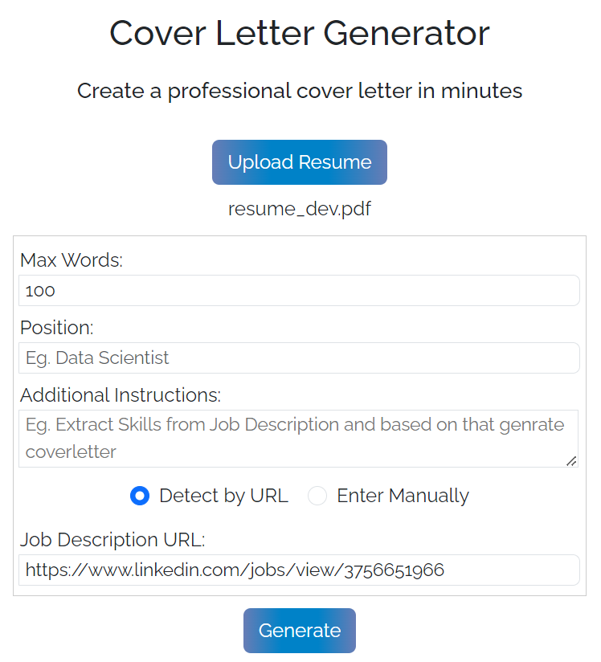

# Cover Letter Generator

## Overview

This application is a Chrome extension that helps you to gerate cover letter instantly without switching from application to another. 

## Installation

### Chrome Extension

1. Navigate to `chrome://extensions` in your Chrome browser.
2. Enable Developer mode by ticking the checkbox in the upper-right corner.
3. Click on the "Load unpacked" button.
4. Select the `plugin` directory from your project.

### Backend Setup

1. Navigate to the `backend` directory.
2. Upgrade pip by running `python -m pip install --upgrade pip`.
3. Install the required dependencies by running `pip install -r requirements.txt`.
4. Start the application by running `python app.py`.

## Configuration

To configure the application, you need to set the OpenAI API key in the `.env` file:

1. Copy the `.env.example` file and rename it to `.env`.
2. Open the `.env` file and replace `YOUR_OPENAI_API_KEY` with your actual OpenAI API key.

## Iput Interface



## Sample Output

### 1. Sample JD 
```
Job brief
We are looking for a passionate certified Data Analyst at Sample Company. The successful candidate will turn data into information, information into insight and insight into business decisions.

Data Analyst Job Duties
Data analyst responsibilities include conducting full lifecycle analysis to include requirements, activities and design. Data analysts will develop analysis and reporting capabilities. They will also monitor performance and quality control plans to identify improvements.

Responsibilities
Interpret data, analyze results using statistical techniques and provide ongoing reports
Develop and implement databases, data collection systems, data analytics and other strategies that optimize statistical efficiency and quality
Acquire data from primary or secondary data sources and maintain databases/data systems
Identify, analyze, and interpret trends or patterns in complex data sets
Filter and “clean” data by reviewing computer reports, printouts, and performance indicators to locate and correct code problems
Work with management to prioritize business and information needs
Locate and define new process improvement opportunities
Requirements and skills
Proven working experience as a Data Analyst or Business Data Analyst
Technical expertise regarding data models, database design development, data mining and segmentation techniques
Strong knowledge of and experience with reporting packages (Business Objects etc), databases (SQL etc), programming (XML, Javascript, or ETL frameworks)
Knowledge of statistics and experience using statistical packages for analyzing datasets (Excel, SPSS, SAS etc)
Strong analytical skills with the ability to collect, organize, analyze, and disseminate significant amounts of information with attention to detail and accuracy
Adept at queries, report writing and presenting findings
BS in Mathematics, Economics, Computer Science, Information Management or Statistics
```

### 2. Sample Resume
```
# Zara Davenport

- Email: zara@davenport.com
- Phone: (567) 890-2345
- LinkedIn: [linkedin.com/in/zara-davenport](https://www.linkedin.com/in/zara-davenport)
- Twitter: [@zara.davenport](https://twitter.com/zara.davenport)

## Python Developer

Python Developer with a proven track record of developing and deploying web applications that resulted in a 25% increase in user engagement and a 20% increase in revenue. Skilled in optimizing code for performance and scalability, reducing page load times by 40%, and supporting a 50% increase in traffic. A mentor to junior developers, resulting in a 30% improvement in code quality and a 15% increase in team productivity.

### Work Experience

**Python Developer**
*01/2023 – 04/2023*
*PythonDevPro LLC*

- Developed and deployed a Python-based web application that integrated data from multiple sources, resulting in a 25% increase in user engagement and a 20% increase in revenue.
- Optimized code for performance and scalability, reducing page load times by 40% and supporting a 50% increase in traffic.
- Mentored junior developers and provided technical guidance, resulting in a 30% improvement in code quality and a 15% increase in team productivity.

**Software Developer**
*09/2022 – 12/2022*
*PythonPro Developers*

- Collaborated with cross-functional teams to design and develop a RESTful API that integrated with multiple third-party systems, resulting in a 30% increase in data accuracy and a 25% reduction in manual data entry.
- Wrote and executed unit tests and integration tests, ensuring code quality and reducing the number of production issues by 40%.
- Contributed to open-source projects and communities, gaining recognition and building a strong professional network within the Python development community.

**Python Software Developer**
*07/2022 – 09/2022*
*PythonDeveloper Masters*

- Developed and maintained a Python-based software system that processed and analyzed large datasets, resulting in a 50% reduction in data processing time and a 40% increase in data accuracy.
- Troubleshot and debugged issues in the existing codebase, reducing the number of production issues by 30% and improving system reliability by 25%.
- Stayed up-to-date with emerging trends and technologies in Python development, implementing new tools and techniques that improved team efficiency by 20%.

### Skills & Competencies

- Python programming
- Web application development
- Data integration
- Performance optimization
- Scalability
- Code quality
- Team mentoring
- RESTful API design
- Unit testing
- Integration testing
- Open-source contribution
- Data processing
- Data analysis
- Troubleshooting
- Debugging
- Emerging trends and technologies
- Software maintenance
- Cross-functional collaboration
- Professional networking

### Courses / Certifications

- **Python Institute - Certified Entry-Level Python Programmer (PCEP)**
  - *06/2023*
  - Python Institute

- **Microsoft Certified: Python Developer Associate (98-381)**
  - *06/2022*
  - Microsoft

- **Certification 3 for Python Developer: OpenEDG Python Institute - Certified Associate in Python Programming (PCAP)**
  - *06/2021*
  - OpenEDG Python Institute

### Education

- **Bachelor of Science in Computer Science**
  - *2018-2022*
  - *Rochester Institute of Technology, Rochester, NY*
  - *Computer Science*
  - *Applied Mathematics*

```

### 3. AI Genrated Cover Letter  

```
Dear Hiring Manager,

I am writing to express my strong interest in the Data Analyst position at Sample Company. With a proven track record as a Python Developer, I am passionate about turning data into business insights and decisions. I am impressed with Sample Company’s commitment to optimizing statistical efficiency and quality, and I am eager to contribute to this mission.

In my previous role at PythonDevPro LLC, I developed and deployed a Python-based web application that resulted in a 25% increase in user engagement and a 20% increase in revenue. My technical expertise in database design development, data mining, and statistical analysis aligns perfectly with the requirements for the Data Analyst role at Sample Company.

I am confident that my strong analytical skills, technical knowledge, and experience make me the perfect fit for this position. I am looking forward to the opportunity to discuss how I can contribute to the success of Sample Company. Thank you for considering my application. I have attached my resume for your review and look forward to the possibility of discussing this exciting opportunity with you.

Sincerely,
Zara Davenport
```

## Contributions

We welcome contributions from everyone. Here are a few guidelines to follow:

1. **Fork the Repository**: Start by forking the repository to your own GitHub account.

2. **Clone the Repository**: Clone the forked repository to your local machine.

3. **Create a New Branch**: Always create a new branch for each contribution.

4. **Make Your Changes**: Make your changes in the new branch.

5. **Commit Your Changes**: Commit your changes with a clear and concise commit message.

6. **Push Your Changes**: Push your changes to your forked repository.

7. **Create a Pull Request**: Create a pull request from your forked repository to the original repository.

Please note that this project is released with a [Contributor Code of Conduct](CODE_OF_CONDUCT.md). By participating in this project you agree to abide by its terms.